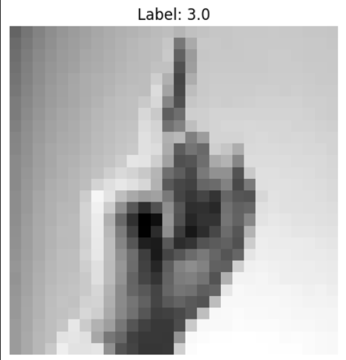
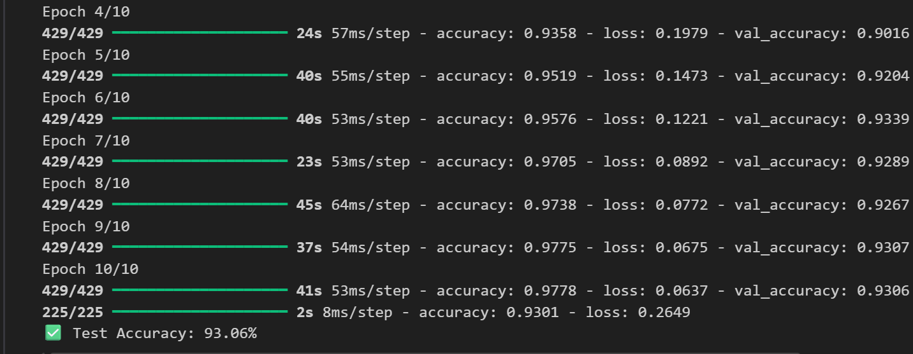
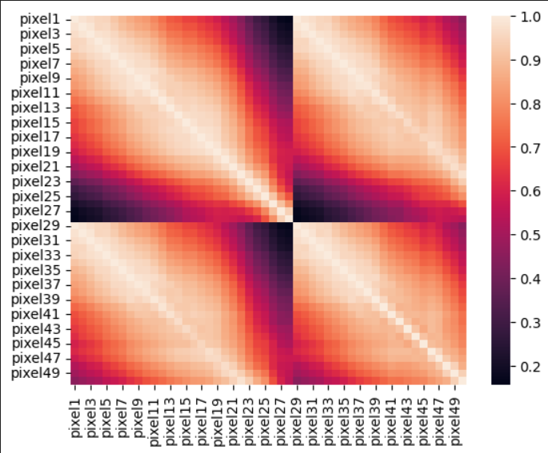
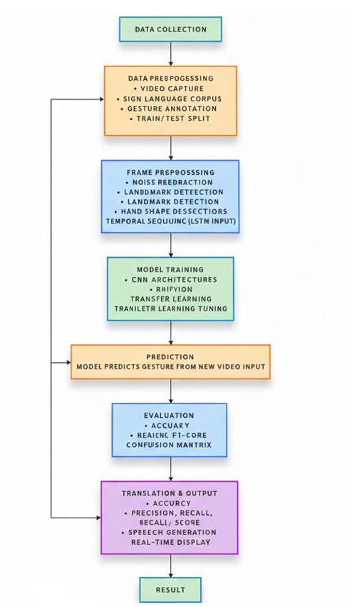

# 🖐️ Automated Sign Language Detector (AI + Computer Vision)

---

## 🧠 Project Overview

The **Automated Sign Language Detector** is an AI-powered system designed to bridge communication gaps between hearing-impaired individuals and people who do not understand sign language.

The system captures hand gestures through a camera/webcam and uses **Artificial Intelligence (AI)** and **Machine Learning (ML)** techniques to recognize and convert sign language into **text and speech output in real time**.

This project aims to improve accessibility and inclusivity by enabling smooth communication without the need for a human interpreter.

---

## 🎯 Problem Statement

Hearing-impaired individuals often face communication barriers in daily life due to the lack of people who understand sign language.

### Key challenges:
- Lack of real-time translation tools  
- Dependence on human interpreters  
- Communication gaps in education, healthcare, and workplaces  

This system solves these issues by providing an **automated sign-to-text conversion system**.

---

## ⚙️ System Workflow

### 1. 📸 Image Acquisition
- Captures hand gestures using a webcam or camera  
- Collects real-time image frames  

---

### 2. 🧹 Image Preprocessing
- Resizing images  
- Noise removal  
- Background filtering  
- Feature enhancement  

---

### 3. 🧠 Gesture Recognition (CNN Model)
- Uses a **Convolutional Neural Network (CNN)**  
- Classifies gestures based on trained dataset  
- Maps each gesture to corresponding alphabet/word  

---

### 4. 📝 Output Generation
- Converts prediction into **text format**  
- Optional **Text-to-Speech (TTS)** converts text into audio  

---

## 🏗️ System Architecture

Camera Input → Image Preprocessing → CNN Model → Gesture Classification → Text Output → Speech Output (Optional)

---

## 🧰 Tech Stack

- Python  
- OpenCV  
- TensorFlow / Keras (CNN Model)  
- NumPy  
- Matplotlib (visualization)  
- Text-to-Speech (TTS library)  

---

## 📊 Dataset & Model Visualizations

### 📌 Class Distribution

---

### 📌 Label Samples

---

### 📌 Model Accuracy

---

### 📌 Model Loss

---

### 📌 Training Accuracy Curve

---

### 📌 Confusion Matrix / Heatmap

---

## 🧠 Model Training

- Dataset: Sign Language MNIST / Gesture Images  
- Model: Convolutional Neural Network (CNN)  
- Output: Alphabets / gesture classes  
- Training includes feature extraction + classification  

---

## 🖐️ Project Outputs

### 🏠 Home Page

---

### 🤖 Output Prediction Page

---

### 🔄 System Flowchart

---

## 🚀 Key Features

- Real-time sign language detection  
- Camera-based gesture recognition  
- CNN-based classification model  
- Text output conversion  
- Optional speech output (TTS)  
- No human interpreter required  

---

## 🌍 Applications

- Schools for hearing-impaired students  
- Hospitals for patient communication  
- Public service centers  
- Workplace accessibility  
- Assistive AI systems  

---

## 🔮 Future Enhancements

- Support for full sentence recognition  
- Multi-language sign detection  
- Mobile app integration  
- Improved accuracy using advanced deep learning models (YOLO / Transformers)  
- Facial expression recognition  

---

## 🏆 Project Impact

This project demonstrates:

- Deep Learning (CNN)  
- Computer Vision  
- Human-computer interaction  
- Assistive AI systems  

It contributes to **accessibility, inclusivity, and real-world AI applications**, making it suitable for internships, research, and abroad scholarship profiles.

---

## 👩‍💻 Author

**Charuhasini**  
AI & Data Science Student  

🔗 GitHub: https://github.com/Charuhasini30
